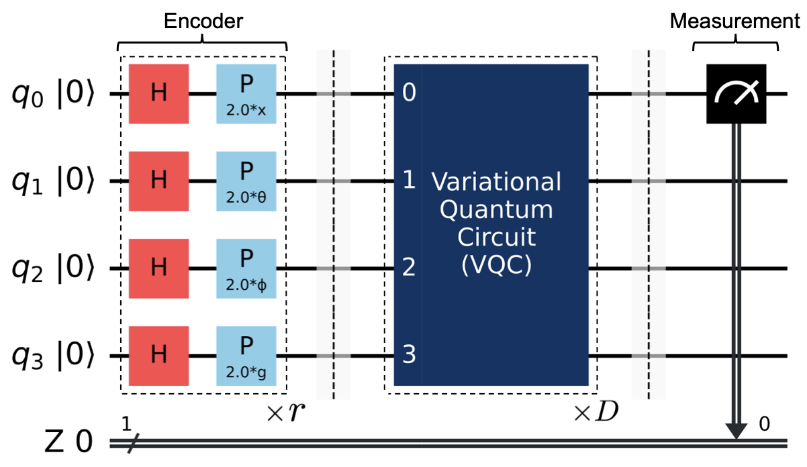
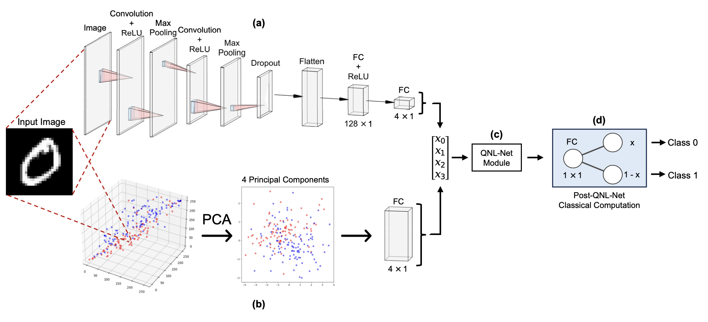

# QNL-Net for Image Classification  
**Implemented by Matteo Piras**

## 🧠 Overview

This project contains an implementation and extension of the **Quantum Non-Local Neural Network (QNL-Net)**, a scalable hybrid quantum-classical architecture designed to improve pattern recognition in image classification tasks. The QNL-Net aims to overcome the quadratic time and memory complexity of classical non-local operations by leveraging **quantum parallelism** and **entanglement** to efficiently process long-range dependencies.

The model combines **classical dimensionality reduction techniques** (CNN or PCA) with a **trainable Variational Quantum Circuit (VQC)**. The hybrid design enables QNL-Net to emulate non-local behavior while exploiting quantum-enhanced features.

## 🚀 Key Concepts

- **QNL-Net** integrates non-local neural network mechanisms with quantum computing principles.
- The architecture includes:
  - A **classical preprocessing stage** (CNN or PCA) to reduce input images to 4 features.
  - A **quantum module** composed of:
    - An **Encoder** (Hadamard + parameterized Phase gates)
    - A **Variational Quantum Circuit (VQC)** using Rx, Ry, Rz gates and entangling CX (CNOT) gates.
    - Three distinct **entanglement strategies**: Ansatz-0 (cyclic), Ansatz-1 (reverse linear), and Ansatz-2 (mixed).
    - **Measurement** on qubit 0 in the **Pauli-Z basis**.
  - A **final classical FC layer** for post-processing the quantum output.

---

### 🧩 Quantum Circuit

  
*Figure 1 – The 4-qubit quantum circuit used in QNL-Net: it consists of an Encoder (Hadamard + Phase), a trainable Variational Quantum Circuit (VQC), and final measurement on qubit 0.*

---

### 🔀 Entanglement Strategies

  
*Figure 2 – The three VQC ansätze: Ansatz-0 (cyclic entanglement), Ansatz-1 (reversed linear chain), and Ansatz-2 (mixed). Each block uses Rx, Ry, Rz rotations and CX gates.*

---

### 🧱 Full Hybrid Architecture

  
*Figure 3 – The complete QNL-Net architecture: (a) CNN-QNL-Net with convolutional preprocessing; (b) PCA-QNL-Net with PCA; (c) quantum module; (d) post-QNL-Net classical refinement.*

---

## ➕ Multiclass Extension

In addition to the original binary classification approach described in the paper, this implementation introduces an **extension to multiclass classification with 4 classes**, demonstrating the flexibility and generalizability of the QNL-Net architecture.

---

## 📁 Repository Structure

This repository contains two Jupyter Notebooks:

- `MNIST_QNL_Net.ipynb`  
  Implements QNL-Net for **multiclass classification** on the **MNIST** dataset.

- `CIFAR10_QNL_Net.ipynb`  
  Implements QNL-Net for both **binary classification** and **multiclass classification (4 classes)** on the **CIFAR-10** dataset.

Each notebook explores different **VQC configurations** and training setups.

---

## 📌 References

Original paper:  
> Gupta, S., Konar, D., & Aggarwal, V. (2023). *Quantum Non-Local Neural Networks for Image Classification.*
